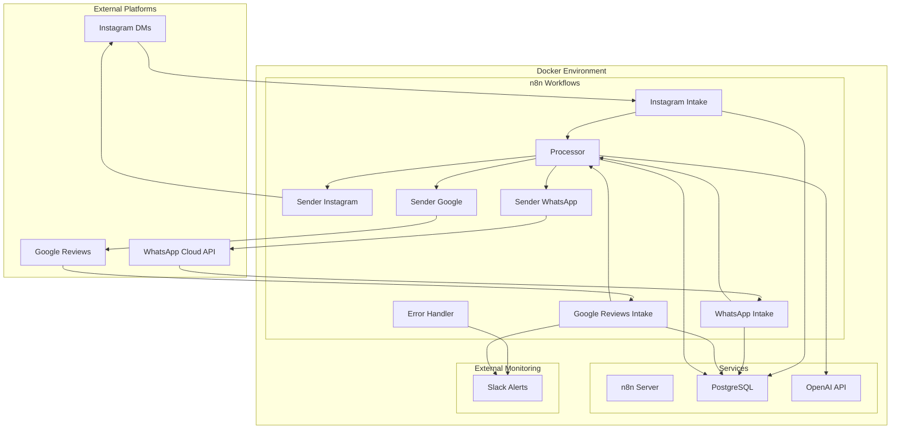

# Design Document

## Overview

The multi-platform auto response system is built as a single Docker Compose stack with n8n and Postgres, with n8n as the central orchestration engine. The system processes incoming messages from Instagram DMs, WhatsApp Cloud API, and Google Business Profile reviews, applies AI-powered sentiment analysis and response generation via OpenAI, and sends contextually appropriate responses while respecting platform-specific policies.

The architecture follows an event-driven pattern where each platform has dedicated intake workflows that normalize data, process it through a central AI engine, and route responses through platform-specific senders. All interactions are logged to PostgreSQL with correlation tracking for monitoring and debugging.

## Architecture

### High-Level Architecture



### Service Architecture

- **n8n**: Central orchestration engine running workflows as webhooks
- **PostgreSQL**: Primary data store for messages, reviews, and error logs
- **OpenAI API**: External service for sentiment analysis and response generation
- **Slack**: External alerting system for escalations and errors

## Components and Interfaces

### Intake Workflows

Each platform has a dedicated intake workflow that handles platform-specific webhook formats and normalizes data for processing.

#### Instagram Intake (`instagram_intake.json`)
- **Trigger**: Webhook at `/webhook/instagram-intake` with Meta verify token
- **Input**: Instagram webhook payload with sender_id, message text, timestamp
- **Processing**: 
  - Validates 24-hour policy window
  - Normalizes to standard message format
  - Inserts record to messages table
- **Output**: Calls processor or sends Slack alert if outside policy window

#### WhatsApp Intake (`whatsapp_intake.json`)
- **Trigger**: Webhook at `/webhook/whatsapp-intake` with Meta verify token
- **Input**: WhatsApp Cloud API webhook payload
- **Processing**:
  - Determines session age (24-hour window)
  - Normalizes phone number and message text
  - Inserts record to messages table
- **Output**: Calls processor with session mode indicator

#### Google Reviews Intake (`google_reviews_intake.json`)
- **Trigger**: n8n Google Business Profile Trigger for new reviews or a 5 minute Schedule poll to fetch new reviews
- **Input**: Review data with rating, text, author, timestamp
- **Processing**:
  - Normalizes review data
  - Inserts record to reviews table
- **Output**: Calls processor and conditionally sends Slack alerts

### Central Processor (`processor.json`)

The processor is the AI brain of the system, handling sentiment analysis, intent detection, and response generation.

**Interface:**
```json
{
  "input": {
    "text": "string",
    "platform": "instagram|whatsapp|google_reviews", 
    "timestamp": "ISO8601",
    "correlation_id": "uuid",
    "session_mode": "text|template" // Optional, WhatsApp only
  },
  "output": {
    "language": "tr|en|...",
    "sentiment": "Positive|Neutral|Negative",
    "score": "0.0-1.0",
    "intent": "Greeting|Booking|Pricing|Complaint|Other",
    "template_id": "string",
    "reply_text": "string",
    "correlation_id": "uuid"
  }
}
```

**Processing Steps:**
1. **Single OpenAI Chat call**: Return JSON fields language, sentiment, intent, reply_text. Reply under 500 characters. Turkish by default. No emojis in Google replies.

### Sender Workflows

Platform-specific senders handle the actual message delivery using each platform's API.

#### Instagram Sender (`sender_instagram.json`)
- **API**: Facebook Graph API v17.0 `/me/messages`
- **Authentication**: Bearer token from `FB_PAGE_TOKEN`
- **Payload**: Recipient ID, message text, messaging_type: "RESPONSE"

#### WhatsApp Sender (`sender_whatsapp.json`) 
- **API**: WhatsApp Business Cloud API
- **Modes**:
  - Text mode: Free-form messages within 24-hour window
  - Template mode: Pre-approved templates for outside 24-hour window
- **Authentication**: Bearer token from `WA_PERMANENT_TOKEN`

#### Google Business Profile Sender (`sender_gbp.json`)
- **API**: Google Business Profile API
- **Authentication**: Service account or OAuth2 credentials
- **Payload**: Location ID, review ID, reply text

### Error Handler (`error_handler.json`)

Centralized error handling workflow triggered by any workflow failures.

**Processing:**
- Captures workflow name, node, error message, and payload
- Inserts error record to database
- Sends Slack alert if webhook configured

## Data Models

### Messages Table
```sql
CREATE TABLE messages (
    id UUID PRIMARY KEY DEFAULT gen_random_uuid(),
    platform VARCHAR(20) NOT NULL,
    external_id VARCHAR(255),
    sender VARCHAR(255),
    language VARCHAR(10),
    sentiment VARCHAR(20),
    intent VARCHAR(50),
    template_id VARCHAR(100),
    response_time_ms INTEGER,
    outcome VARCHAR(50),
    created_at TIMESTAMP DEFAULT NOW(),
    correlation_id UUID NOT NULL
);

CREATE INDEX idx_messages_created_at ON messages(created_at);
CREATE INDEX idx_messages_platform ON messages(platform);
CREATE INDEX idx_messages_correlation_id ON messages(correlation_id);
```

### Reviews Table
```sql
CREATE TABLE reviews (
    id UUID PRIMARY KEY DEFAULT gen_random_uuid(),
    review_id VARCHAR(255) UNIQUE NOT NULL,
    rating INTEGER,
    language VARCHAR(10),
    sentiment VARCHAR(20),
    template_id VARCHAR(100),
    response_time_ms INTEGER,
    outcome VARCHAR(50),
    created_at TIMESTAMP DEFAULT NOW(),
    correlation_id UUID NOT NULL
);

CREATE INDEX idx_reviews_created_at ON reviews(created_at);
CREATE INDEX idx_reviews_correlation_id ON reviews(correlation_id);
```

### Errors Table
```sql
CREATE TABLE errors (
    id UUID PRIMARY KEY DEFAULT gen_random_uuid(),
    workflow VARCHAR(100),
    node VARCHAR(100),
    message TEXT,
    payload JSONB,
    created_at TIMESTAMP DEFAULT NOW()
);

CREATE INDEX idx_errors_created_at ON errors(created_at);
```

### Templates Structure
```json
{
  "google": {
    "tr": {
      "positive": "Teşekkür ederiz {first_name}. Sizi tekrar ağırlamak isteriz.",
      "negative": "Yaşadığınız deneyim için üzgünüz {first_name}. Hemen yardımcı olalım. Bize {phone} üzerinden ulaşın ya da DM atın."
    }
  },
  "instagram": {
    "tr": {
      "greeting": "Merhaba {first_name}. Size nasıl yardımcı olabiliriz?"
    }
  },
  "whatsapp": {
    "tr": {
      "outside24h": "Merhaba {first_name}. {BRAND_NAME}. 1 Randevu. 2 Fiyatlar. 3 Görüşme"
    }
  }
}
```

## Error Handling

### Policy Compliance Errors
- **Instagram 24-hour violation**: Log incident, send Slack alert with correlation ID, do not auto-respond
- **WhatsApp template violations**: Use only approved templates outside 24-hour window
- **Google Review escalation**: Alert on rating ≤ 2 or negative sentiment

### Technical Errors
- **API failures**: Retry 3 times at 1s, 2s, 4s. Then log and alert Slack.
- **OpenAI failures**: Send short Turkish fallback template and log.
- **Database failures**: Log error and alert. No queue.

### Monitoring and Alerting
- All errors logged to PostgreSQL errors table
- Slack alerts for negative reviews and hard failures only
- Correlation IDs for end-to-end request tracking

## Testing Strategy

### Unit Testing
- Template selection logic validation
- Message normalization functions
- Policy compliance checks

### Integration Testing
- End-to-end workflow testing with synthetic payloads
- Database connectivity and data persistence
- External API integration (OpenAI, platform APIs)

### Synthetic Test Cases

#### Test Case 1: Turkish Instagram DM
```json
{
  "sender_id": "test_user_123",
  "text": "Merhaba, randevu almak istiyorum",
  "timestamp": "2024-01-15T10:00:00Z"
}
```
**Expected**: Turkish response with diacritics, polite "Siz" form, booking intent detected

#### Test Case 2: WhatsApp Session Modes
```json
{
  "phone": "+905551234567",
  "text": "Fiyat bilgisi",
  "timestamp_within_24h": "2024-01-15T10:00:00Z",
  "timestamp_outside_24h": "2024-01-13T10:00:00Z"
}
```
**Expected**: Free text response within 24h, template response outside 24h

#### Test Case 3: Google Review Escalation
```json
{
  "rating": 2,
  "text": "Çok kötü hizmet aldık",
  "author": "Test User"
}
```
**Expected**: Slack alert with AI-generated draft, no auto-reply

### Performance Testing
- Target 10 concurrent messages. End to end under 10 seconds median.
- Database performance under load

### Deployment Testing
- Single command deployment verification: `make up && make import && make activate`
- Webhook URL generation and accessibility
- Environment variable validation
- Service health checks